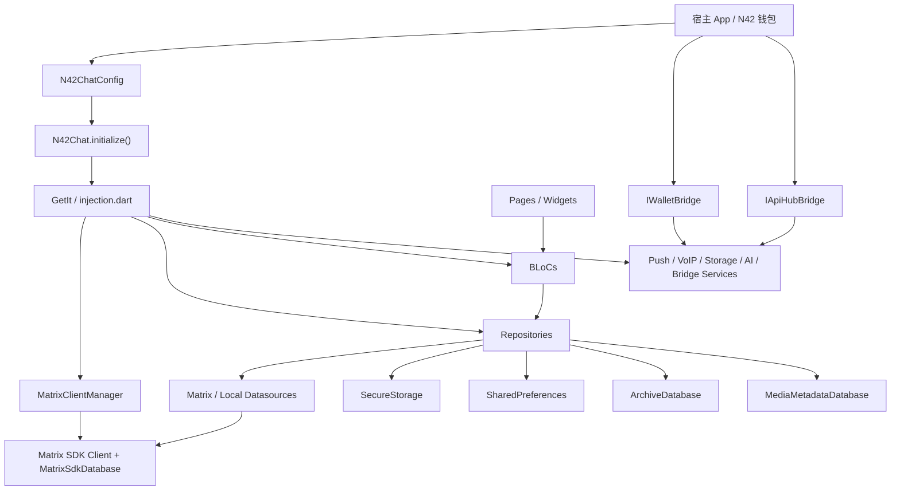

# n42_chat 架构与数据流审计

生成时间: 2026-03-13

## 1. 模块定位

`n42_chat` 不是一个“聊天 UI 插件”，而是一个完整的聊天子系统。它同时承载了：

- Matrix 客户端生命周期管理
- 认证与会话恢复
- 本地缓存与扩展存储
- 消息、会话、联系人、群组仓库
- 推送通知与 VoIP 初始化
- 钱包桥接、API Hub 桥接、链上通知、积分、社交图谱、治理等扩展能力
- 大量页面、BLoC、业务服务

从结构上看，它更接近“嵌入式业务子应用”而不是“轻量 package”。

核心分层：

- 入口/编排层: `lib/src/n42_chat.dart`
- 配置层: `lib/src/n42_chat_config.dart`
- 依赖注入层: `lib/src/core/di/injection.dart`
- Matrix 适配层: `lib/src/data/datasources/matrix/*.dart`
- 仓库层: `lib/src/data/repositories/*.dart`
- 状态管理层: `lib/src/presentation/blocs/*`
- 页面层: `lib/src/presentation/pages/*`
- 本地存储层: `SecureStorage` + `SharedPreferences` + `MatrixSdkDatabase` + `ArchiveDatabase` + `MediaMetadataDatabase`

## 2. 总体架构

## 3. 启动与依赖注入流程

### 3.1 启动顺序

入口由 `N42Chat.initialize()` 负责，集中完成全局编排：

- 保存配置并处理并发初始化保护
- 必要时重置 `GetIt`
- 调用 `configureDependencies(config)`
- 构建全局 `AuthBloc`
- 触发 `AuthRestoreSessionRequested`
- 后台初始化 Push
- 已登录时初始化 CallManager
- 安装 Moment invite sync 监听

关键代码：

- [n42_chat.dart](/Users/jieliu/Documents/n42/n42_chat/lib/src/n42_chat.dart#L224)
- [n42_chat.dart](/Users/jieliu/Documents/n42/n42_chat/lib/src/n42_chat.dart#L262)
- [n42_chat.dart](/Users/jieliu/Documents/n42/n42_chat/lib/src/n42_chat.dart#L265)
- [n42_chat.dart](/Users/jieliu/Documents/n42/n42_chat/lib/src/n42_chat.dart#L270)
- [n42_chat.dart](/Users/jieliu/Documents/n42/n42_chat/lib/src/n42_chat.dart#L289)

### 3.2 DI 结构

`configureDependencies()` 的注册顺序是：

1. Config / Bridge
2. Services
3. Datasources
4. Repositories
5. BLoCs
6. `getIt.allReady()`

特点：

- 初始化阶段就尝试创建 Matrix 客户端
- BLoC 直接依赖 Repository，没有 UseCase 层
- 功能开关驱动可选模块注册，如协议抽象、社交图谱、积分、链上推送

关键代码：

- [injection.dart](/Users/jieliu/Documents/n42/n42_chat/lib/src/core/di/injection.dart#L135)
- [injection.dart](/Users/jieliu/Documents/n42/n42_chat/lib/src/core/di/injection.dart#L186)
- [injection.dart](/Users/jieliu/Documents/n42/n42_chat/lib/src/core/di/injection.dart#L262)
- [injection.dart](/Users/jieliu/Documents/n42/n42_chat/lib/src/core/di/injection.dart#L392)
- [injection.dart](/Users/jieliu/Documents/n42/n42_chat/lib/src/core/di/injection.dart#L734)

## 4. 认证与会话数据流

### 4.1 登录流

认证入口在 `AuthRepositoryImpl`：

1. `AuthRepositoryImpl.login()` 调 `MatrixAuthDataSource.loginWithPassword()`
2. `MatrixAuthDataSource` 确保 `MatrixClientManager` 初始化完成
3. `MatrixClientManager.login()` 完成 Matrix SDK 登录
4. 回到 `AuthRepositoryImpl` 保存会话到 `SecureStorage`
5. 可选保存“记住我”凭据
6. 后台触发 `startSync()`
7. 拉取用户资料并更新登录态流

关键代码：

- [auth_repository_impl.dart](/Users/jieliu/Documents/n42/n42_chat/lib/src/data/repositories/auth_repository_impl.dart#L81)
- [auth_repository_impl.dart](/Users/jieliu/Documents/n42/n42_chat/lib/src/data/repositories/auth_repository_impl.dart#L111)
- [auth_repository_impl.dart](/Users/jieliu/Documents/n42/n42_chat/lib/src/data/repositories/auth_repository_impl.dart#L131)
- [matrix_auth_datasource.dart](/Users/jieliu/Documents/n42/n42_chat/lib/src/data/datasources/matrix/matrix_auth_datasource.dart#L33)
- [matrix_client_manager.dart](/Users/jieliu/Documents/n42/n42_chat/lib/src/data/datasources/matrix/matrix_client_manager.dart#L67)

### 4.2 会话恢复流

`AuthRestoreSessionRequested` 之后，仓库优先使用“SDK 已有本地会话”的快速恢复路径；如果没有，再走安全存储中的 token/session。

这意味着实际的会话源有两套：

- Matrix 自身 SQLite/Drift 数据库中的持久会话
- `SecureStorage` 中的 session/token 备份

这是性能友好的，但也带来双源一致性管理问题。

### 4.3 认证存储边界

敏感数据走 `SecureStorageDataSource`：

- session
- credentials
- accounts
- biometric settings

非敏感状态走 `PreferencesDataSource`：

- 外观
- 备注
- 强提醒
- 草稿/本地删除/定时消息/翻译缓存等

关键代码：

- [secure_storage_datasource.dart](/Users/jieliu/Documents/n42/n42_chat/lib/src/data/datasources/local/secure_storage_datasource.dart#L11)
- [secure_storage_datasource.dart](/Users/jieliu/Documents/n42/n42_chat/lib/src/data/datasources/local/secure_storage_datasource.dart#L32)
- [preferences_datasource.dart](/Users/jieliu/Documents/n42/n42_chat/lib/src/data/datasources/local/preferences_datasource.dart#L7)
- [preferences_datasource.dart](/Users/jieliu/Documents/n42/n42_chat/lib/src/data/datasources/local/preferences_datasource.dart#L17)

## 5. Matrix 客户端与同步数据流

### 5.1 客户端初始化

`MatrixClientManager.initialize()` 负责：

- 初始化 vodozemac
- 选择数据库路径
- 原生平台打开 `sqflite` 数据库
- 初始化 `MatrixSdkDatabase`
- 创建 `matrix.Client`
- 指定密钥共享策略 `shareKeysWith`
- 先加载本地数据库，不等待首个网络同步

关键代码：

- [matrix_client_manager.dart](/Users/jieliu/Documents/n42/n42_chat/lib/src/data/datasources/matrix/matrix_client_manager.dart#L73)
- [matrix_client_manager.dart](/Users/jieliu/Documents/n42/n42_chat/lib/src/data/datasources/matrix/matrix_client_manager.dart#L144)
- [matrix_client_manager.dart](/Users/jieliu/Documents/n42/n42_chat/lib/src/data/datasources/matrix/matrix_client_manager.dart#L160)
- [matrix_client_manager.dart](/Users/jieliu/Documents/n42/n42_chat/lib/src/data/datasources/matrix/matrix_client_manager.dart#L182)

### 5.2 同步流

`startSync()` 做的事情是：

1. 试图配置优化 filter
2. 打开 `backgroundSync`
3. 最多等待 3 秒首个 sync 回包
4. UI 不依赖首个完整同步才显示内容

关键代码：

- [matrix_client_manager.dart](/Users/jieliu/Documents/n42/n42_chat/lib/src/data/datasources/matrix/matrix_client_manager.dart#L364)
- [matrix_client_manager.dart](/Users/jieliu/Documents/n42/n42_chat/lib/src/data/datasources/matrix/matrix_client_manager.dart#L372)
- [matrix_client_manager.dart](/Users/jieliu/Documents/n42/n42_chat/lib/src/data/datasources/matrix/matrix_client_manager.dart#L385)

### 5.3 同步事件传播

大多数实时能力都建立在 `client.onSync.stream` 上：

- 会话列表更新
- 房间更新
- 消息刷新
- Push 本地通知触发
- Moment invite 自动处理
- Points tracking

这是简单统一的做法，但也意味着大量模块都耦合在同一个同步脉冲上。

## 6. 会话列表数据流

### 6.1 房间到会话实体映射

`ConversationRepositoryImpl` 直接把 Matrix `Room` 映射成 `ConversationEntity`：

- 名称、头像、是否私聊/群聊
- 最后一条消息预览
- 未读数/高亮数
- 是否免打扰/置顶/加密
- 成员信息

关键代码：

- [conversation_repository_impl.dart](/Users/jieliu/Documents/n42/n42_chat/lib/src/data/repositories/conversation_repository_impl.dart#L18)
- [conversation_repository_impl.dart](/Users/jieliu/Documents/n42/n42_chat/lib/src/data/repositories/conversation_repository_impl.dart#L154)

### 6.2 会话列表刷新机制

`watchConversations()` 订阅 `MatrixRoomDataSource.onRoomsChanged`，后者本质上是：

- 每次 `client.onSync.stream` 触发
- 重新调用 `getSortedRooms()`
- 再 map 成 `ConversationEntity`

这是“全量重算 + 本地缓存优化”的路线，而不是增量 patch 路线。

## 7. 聊天消息数据流

### 7.1 打开聊天页

`ChatPage.initState()` 做了多件事：

- 标记当前房间为活跃，避免重复通知
- 清除该房间系统通知
- 触发 `InitializeChat(roomId)`
- 加载当前用户、背景、草稿、字体、人脸模糊、备注订阅等

关键代码：

- [chat_page.dart](/Users/jieliu/Documents/n42/n42_chat/lib/src/presentation/pages/chat/chat_page.dart#L207)
- [chat_page.dart](/Users/jieliu/Documents/n42/n42_chat/lib/src/presentation/pages/chat/chat_page.dart#L217)

### 7.2 ChatBloc 初始化

`ChatBloc._onInitializeChat()` 的策略是“本地优先”：

1. 先清状态和本地删除记录
2. 立即显示页面
3. 从 `MessageRepository.getMessages()` 拿首屏缓存
4. 再订阅实时消息
5. 后台补全完整消息
6. 并行启动阅后即焚、定时消息、投票、置顶消息等子流程

关键代码：

- [chat_bloc.dart](/Users/jieliu/Documents/n42/n42_chat/lib/src/presentation/blocs/chat/chat_bloc.dart#L196)
- [chat_bloc.dart](/Users/jieliu/Documents/n42/n42_chat/lib/src/presentation/blocs/chat/chat_bloc.dart#L213)
- [chat_bloc.dart](/Users/jieliu/Documents/n42/n42_chat/lib/src/presentation/blocs/chat/chat_bloc.dart#L237)

### 7.3 消息仓库与时间线

`MessageRepositoryImpl` 的核心模型是：

- 每个房间缓存一个 `Timeline`
- 对消息实体做 5 分钟 LRU 缓存
- 不足量时请求更多历史
- 如果服务端不足量，再从 `ArchiveDatabase` 做归档回退

关键代码：

- [message_repository_impl.dart](/Users/jieliu/Documents/n42/n42_chat/lib/src/data/repositories/message_repository_impl.dart#L18)
- [message_repository_impl.dart](/Users/jieliu/Documents/n42/n42_chat/lib/src/data/repositories/message_repository_impl.dart#L51)
- [message_repository_impl.dart](/Users/jieliu/Documents/n42/n42_chat/lib/src/data/repositories/message_repository_impl.dart#L80)
- [message_repository_impl.dart](/Users/jieliu/Documents/n42/n42_chat/lib/src/data/repositories/message_repository_impl.dart#L109)
- [message_repository_impl.dart](/Users/jieliu/Documents/n42/n42_chat/lib/src/data/repositories/message_repository_impl.dart#L175)

### 7.4 消息发送链路

发送链路大致为：

`ChatPage` -> `ChatBloc` 事件 -> `MessageRepositoryImpl` -> `MatrixMessageDataSource` -> `MatrixMessageSender` / `MatrixMediaUploader` -> Matrix 房间事件

消息读取链路则是：

`client.onSync` -> timeline 更新 -> repository 映射 -> bloc 发状态 -> UI 重绘

## 8. 本地存储与数据分级

这个模块同时使用了五类持久化介质：

1. `MatrixSdkDatabase`
2. `SecureStorage`
3. `SharedPreferences`
4. `ArchiveDatabase`
5. `MediaMetadataDatabase`

它们的职责边界大致是清晰的，但系统层没有一个统一的数据目录、迁移编排器或一致性视图。

特别是消息数据存在三层：

- Matrix 原始 timeline / state
- UI 级本地偏好（删除、定时、自毁、收藏）
- 历史归档数据库

## 9. Push / VoIP 数据流

### 9.1 Push 初始化

`N42Chat.initialize()` 后台创建 `FirebasePushService`，再在已登录状态下调用 `registerForPush()`。

`FirebasePushService` 负责：

- 请求系统通知权限
- 获取 APNs / FCM Token
- 初始化本地通知
- 监听前台消息、点击事件、token 刷新
- 订阅 `client.onSync` 以本地判断并显示消息通知

关键代码：

- [n42_chat.dart](/Users/jieliu/Documents/n42/n42_chat/lib/src/n42_chat.dart#L355)
- [firebase_push_service.dart](/Users/jieliu/Documents/n42/n42_chat/lib/src/core/notifications/firebase_push_service.dart#L34)
- [firebase_push_service.dart](/Users/jieliu/Documents/n42/n42_chat/lib/src/core/notifications/firebase_push_service.dart#L140)
- [firebase_push_service.dart](/Users/jieliu/Documents/n42/n42_chat/lib/src/core/notifications/firebase_push_service.dart#L223)

### 9.2 通话链路

VoIP 初始化由 `N42Chat.initializeCallManager()` 驱动，依赖：

- 当前 Matrix client
- TURN 信息
- LiveKit 配置发现

但页面层仍保留了部分“假实现/待后端替换”的呼叫 UI。

## 10. 宿主集成点

宿主应用主要通过三类方式和 `n42_chat` 交互：

- 配置注入: `N42ChatConfig`
- 业务桥接: `IWalletBridge`, `IApiHubBridge`
- UI 嵌入: `chatWidget()` / router / routes / 页面级调用

钱包桥接不仅用于转账，也用于：

- ENS 解析
- Token gate
- Snapshot 治理签名
- 链上通知身份映射

这使 `n42_chat` 对宿主钱包的依赖已经超出“可选增强”，接近“业务主依赖”。

## 11. 发现的问题

### P1. 公共 facade API 与实际能力不一致

对外暴露了 `N42Chat.login()`、`loginWithToken()`、`logout()`，但全部直接 `throw UnimplementedError`。

影响：

- 对集成方形成误导
- facade 层不能闭环处理最核心的认证生命周期
- 迫使集成方绕过公开 API 直接依赖 `AuthBloc`

证据：

- [n42_chat.dart](/Users/jieliu/Documents/n42/n42_chat/lib/src/n42_chat.dart#L853)
- [n42_chat.dart](/Users/jieliu/Documents/n42/n42_chat/lib/src/n42_chat.dart#L876)
- [n42_chat.dart](/Users/jieliu/Documents/n42/n42_chat/lib/src/n42_chat.dart#L895)

### P1. 配置对象存在死配置，`syncFilter` 没有真正接入同步行为

`N42ChatConfig` 暴露了 `syncFilter`，但代码搜索显示该配置只定义不消费。实际同步过滤器在 `SyncOptimizationService` 里被硬编码为 `timeline.limit=30`、`lazyLoadMembers=true`，而且 `startSync(fullState)` 的 `fullState` 参数也未被使用。

影响：

- 配置文档与运行行为不一致
- 宿主无法真正控制同步量、是否包含 leave rooms、timeline limit
- 容易在性能排查时误判配置已经生效

证据：

- [n42_chat_config.dart](/Users/jieliu/Documents/n42/n42_chat/lib/src/n42_chat_config.dart#L125)
- [n42_chat_config.dart](/Users/jieliu/Documents/n42/n42_chat/lib/src/n42_chat_config.dart#L311)
- [sync_optimization_service.dart](/Users/jieliu/Documents/n42/n42_chat/lib/src/core/services/sync_optimization_service.dart#L40)
- [matrix_client_manager.dart](/Users/jieliu/Documents/n42/n42_chat/lib/src/data/datasources/matrix/matrix_client_manager.dart#L364)

### P1. 功能面明显超前于实际交付，存在“已宣称完成但仍是占位实现”的情况

至少有以下能力仍未完成：

- 贴纸商店仍返回内置样例数据
- facade 认证 API 未实现
- 通话 UI 仍含多个 backend TODO
- 卡券/礼物等聊天扩展未接后端

影响：

- README 和实际能力存在偏差
- 评估上线 readiness 时容易被误导
- QA 与产品验收基线不清晰

证据：

- [sticker_repository_impl.dart](/Users/jieliu/Documents/n42/n42_chat/lib/src/data/repositories/sticker_repository_impl.dart#L34)
- [n42_chat.dart](/Users/jieliu/Documents/n42/n42_chat/lib/src/n42_chat.dart#L853)
- [call_dialog.dart](/Users/jieliu/Documents/n42/n42_chat/lib/src/presentation/widgets/chat/call_dialog.dart#L49)
- [chat_page_more_features.dart](/Users/jieliu/Documents/n42/n42_chat/lib/src/presentation/pages/chat/chat_page_more_features.dart#L511)

### P2. 模块边界过宽，多个“总控类”已经演化成 God Object

典型文件：

- `n42_chat.dart` 负责初始化、push、call、router helper、notification、session helper 等
- `auth_repository_impl.dart` 超过 1100 行
- `firebase_push_service.dart` 超过 1100 行
- `chat_page.dart` 超过 1100 行
- `chat_bloc.dart` 及其多个 part 文件承载大量互不相干能力

影响：

- 变更面过大，回归成本高
- 单点文件容易引入隐式状态耦合
- 很难做模块级测试、所有权划分和稳定演进

证据：

- [n42_chat.dart](/Users/jieliu/Documents/n42/n42_chat/lib/src/n42_chat.dart#L224)
- [auth_repository_impl.dart](/Users/jieliu/Documents/n42/n42_chat/lib/src/data/repositories/auth_repository_impl.dart#L15)
- [firebase_push_service.dart](/Users/jieliu/Documents/n42/n42_chat/lib/src/core/notifications/firebase_push_service.dart#L34)
- [chat_page.dart](/Users/jieliu/Documents/n42/n42_chat/lib/src/presentation/pages/chat/chat_page.dart#L108)
- [chat_bloc.dart](/Users/jieliu/Documents/n42/n42_chat/lib/src/presentation/blocs/chat/chat_bloc.dart#L27)

### P2. BLoC 直接依赖 Repository，缺少 UseCase/应用服务编排层

DI 明确写了“当前架构中 BLoC 直接依赖 Repository，无 UseCase 中间层”。

影响：

- 业务编排逻辑容易下沉到 BLoC / Repository / Page 三处
- 很难表达跨仓库事务边界
- 大功能扩展时只能继续堆到 BLoC 或 Repo

证据：

- [injection.dart](/Users/jieliu/Documents/n42/n42_chat/lib/src/core/di/injection.dart#L734)
- [injection.dart](/Users/jieliu/Documents/n42/n42_chat/lib/src/core/di/injection.dart#L760)

### P2. 持久化层分散，缺少统一的一致性与迁移编排

系统同时维护：

- MatrixSdkDatabase
- SecureStorage
- SharedPreferences
- ArchiveDatabase
- MediaMetadataDatabase

这本身不是错误，但目前只看到“按功能注册”，没有看到统一的版本升级、跨存储回滚或一致性恢复策略。

影响：

- 升级和迁移风险高
- 数据异常时排障复杂
- “消息真实状态”分布在多个来源，容易产生边界缺陷

证据：

- [matrix_client_manager.dart](/Users/jieliu/Documents/n42/n42_chat/lib/src/data/datasources/matrix/matrix_client_manager.dart#L144)
- [secure_storage_datasource.dart](/Users/jieliu/Documents/n42/n42_chat/lib/src/data/datasources/local/secure_storage_datasource.dart#L11)
- [preferences_datasource.dart](/Users/jieliu/Documents/n42/n42_chat/lib/src/data/datasources/local/preferences_datasource.dart#L11)
- [injection.dart](/Users/jieliu/Documents/n42/n42_chat/lib/src/core/di/injection.dart#L262)
- [injection.dart](/Users/jieliu/Documents/n42/n42_chat/lib/src/core/di/injection.dart#L276)

### P2. 运行期异常大多只写 `debugLog`，缺少生产级可观测性

多个关键链路在后台异步失败时只写日志，不上抛、不聚合、不告警：

- 背景同步失败
- Push 初始化失败
- Moment invite 处理失败
- 归档补齐失败

影响：

- 生产问题对用户表现为“偶发无响应/无消息/无推送”
- 很难从监控面做失败归因

证据：

- [auth_repository_impl.dart](/Users/jieliu/Documents/n42/n42_chat/lib/src/data/repositories/auth_repository_impl.dart#L131)
- [auth_repository_impl.dart](/Users/jieliu/Documents/n42/n42_chat/lib/src/data/repositories/auth_repository_impl.dart#L196)
- [n42_chat.dart](/Users/jieliu/Documents/n42/n42_chat/lib/src/n42_chat.dart#L273)
- [n42_chat.dart](/Users/jieliu/Documents/n42/n42_chat/lib/src/n42_chat.dart#L344)
- [message_repository_impl.dart](/Users/jieliu/Documents/n42/n42_chat/lib/src/data/repositories/message_repository_impl.dart#L100)

### P3. 页面层仍承担了过多业务初始化与环境管理职责

`ChatPage.initState()` 同时处理：

- 活跃房间通知屏蔽
- 清通知
- bloc 初始化
- 用户/备注/草稿/背景/字体/人脸模糊读取
- 通话错误回调注入

影响：

- 页面测试复杂
- 生命周期 bug 更隐蔽
- UI 组件很难独立复用

证据：

- [chat_page.dart](/Users/jieliu/Documents/n42/n42_chat/lib/src/presentation/pages/chat/chat_page.dart#L207)

## 12. 整改建议

### 第一阶段：先把“接口真实性”对齐

1. 实现或删除 `N42Chat.login/loginWithToken/logout` facade。
2. 把 README 中“已完成”的能力重新核对一遍，删除占位功能的完成标记。
3. 给每个未完成能力明确 `experimental / stub / backend pending` 标签。

### 第二阶段：收缩核心编排层

1. 把 `n42_chat.dart` 拆成 `bootstrap`, `session_facade`, `push_facade`, `call_facade`。
2. 把 `firebase_push_service.dart` 拆成 `token`, `registration`, `local_notification`, `tap_router`, `sync_bridge`。
3. 把 `AuthRepositoryImpl` 中社交登录、profile、restore、session 逻辑拆成独立应用服务。

### 第三阶段：把配置真正接到运行时

1. 让 `syncFilter` 真正驱动 Matrix filter 定义与启动。
2. 明确 `fullState` 是否支持；如果不支持，删除参数。
3. 给 storage management / push / ai / protocol abstraction 建立启动期配置校验。

### 第四阶段：补可观测性

1. 为登录、同步、push 注册、消息发送、归档回退建立统一 telemetry 接口。
2. 区分用户可见错误、后台恢复错误、需要上报错误。
3. 对关键异步链路引入 trace id / room id / user id 上下文。

## 13. 结论

`n42_chat` 的核心方向是成立的：它已经形成了一个以 Matrix 为通信内核、以宿主钱包桥接为扩展边界、以本地优先体验为目标的聊天子系统。

但当前最大问题不是“少几个功能”，而是：

- 对外接口与实际能力不完全一致
- 架构编排层过重
- 配置与运行时存在脱节
- 扩展功能面已经明显超过当前可维护边界

如果目标是继续把它作为 N42 主应用的正式聊天内核，应优先先做“收口”和“降耦合”，而不是继续往上堆功能页。
