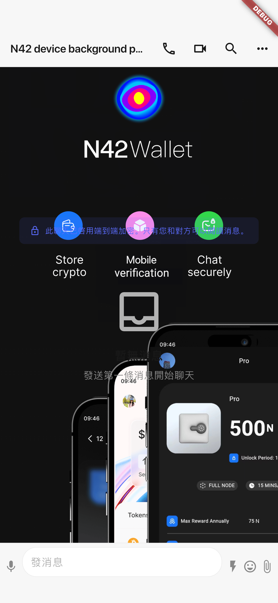

# 真机九测 · 治理入口复测 + 链上确认 — 2026-08-15

## 范围与结论

- 测试基线：`master@c4032e16a59f1e607d768ae695172c0e81d80420`，测试开始时与 `origin/master` 一致。
- 执行原则：只验证、诊断和记录；未修改业务代码。临时真机探针已删除。
- 八测的治理崩溃闭环：iPhone 13 Pro Max 上 `GovernanceBloc` 已注册，Space 治理图标出现，点击后成功打开提案列表，并从 `hub.snapshot.org` 实际加载 Uniswap Snapshot 提案，未再出现 GetIt 异常：**PASS**。
- 无 `DEBANK_API_KEY` 构建的 Social Graph 降级已真机确认：入口可点击并显示 `Social graph is not configured on this build`，没有崩溃或空白页：**PASS**。有效 key + 钱包路径因无 key 保持 **BLOCKED**。
- 照片背景已在 iOS 真机生产 `ChatPage` 内容区实际渲染，导出截图可见完整图片：页面视觉 **PASS**。但测试包重装清除了 Matrix 登录态，验证使用会话实体夹具，不冒充已登录线上房间；系统相册原生 UI 也未完成选择，二者单列 **BLOCKED**。
- Android 在 App 已卸载的前提下仍被 HyperOS 拒绝干净安装：`INSTALL_FAILED_USER_RESTRICTED: Install canceled by user`。因此本轮 Android 页面与钱包链上操作 **BLOCKED**。
- 用户侧未向七/八测地址转入 BNB：三个已知地址在 BSC Mainnet、BSC Testnet、Sepolia 的余额复查仍全部为 `0x0`。A/A2/B/C/D 没有产生交易，继续 **BLOCKED**，无 tx hash。
- 另记录一条非本任务回归：`ChatPage.dispose()` 在真机打印 deactivated context 警告，但被 catch、测试仍通过；归为 **STATIC CONFIRMED**，未改代码。

状态定义：`PASS` 为当前提交在真机完成目标行为；`FAIL` 为当前提交真机可复现不符合预期；`STATIC CONFIRMED` 为代码/日志已确认但没有外部闭环；`BLOCKED` 为缺少测试资产、有效配置、登录态或被设备系统/工具阻断。

## 设备与构建

| 设备 | 系统/连接 | 构建/安装 | 结果 |
|---|---|---|---|
| Android `25098RA98C`，序列号 `38f4f08a` | Android 16 / HyperOS `OS3.0.302.0.WPQCNXM` / USB | c4032e16 Debug APK 构建成功，干净安装失败 | `INSTALL_FAILED_USER_RESTRICTED`，BLOCKED |
| iPhone 13 Pro Max (`iPhone14,3`) | iOS 26.6 (`23G71`) / USB / 已解锁、已配对、Developer Mode | c4032e16 integration Debug 构建、签名、安装和 Flutter 测试附加成功 | chat 真机探针执行成功 |
| Keystone | 无设备 | 未执行 | BLOCKED |

Android 构建证据：

```text
build/app/outputs/flutter-apk/app-debug.apk
size: 748 MB
SHA-256: 9794c5d3e130bc8d3039bd2df003803b3aa130ae7c4ebe81dc4023aaf4afd86a

adb install --no-streaming -t ...
1 file pushed, 0 skipped (784322175 bytes)
Performing Push Install
Failure [INSTALL_FAILED_USER_RESTRICTED: Install canceled by user]
```

安装前 `pm list packages` 已确认 `ai.n42.www` 不存在，因此这不是同签名覆盖冲突；在任务建议的“先卸载再装”状态下仍由 HyperOS 系统侧取消。

## 1. Space 治理入口

### 1.1 DI、图标与页面打开：PASS

iOS 真机使用宿主等价配置初始化 chat：

```text
enableGovernance=true
enableSocialGraph=false
NINTH_DI governance=true socialGraph=false
NINTH_CHAT governanceIcon=1
```

以 `uniswapgovernance.eth` 作为 Space ID，实际点击 `tooltip=Governance` 图标后：

1. `Governance` 提案页成功入栈；
2. `GovernanceBloc` 创建和读取无异常；
3. 八测的 `GetIt: GovernanceBloc is not registered` 未复现。

### 1.2 Snapshot 数据：PASS

真机等待 GraphQL 响应后在列表中找到 `[Temp Check]` 提案：

```text
NINTH_CHAT snapshotProposalsLoaded=true
```

同一时段直接请求 `https://hub.snapshot.org/graphql`，`uniswapgovernance.eth` 返回的最近提案包括：

```text
[Temp Check] - Four for V4
[Temp Check] Protocol Fee Expansion: Robinhood Chain
```

因此本项不是只验证空页面或 DI 注册，而是包含 Snapshot 公开 GraphQL 的设备端真实读取闭环。

## 2. Social Graph

### 2.1 无 DEBANK_API_KEY：PASS

本轮构建没有 `DEBANK_API_KEY`：

```text
getIt.isRegistered<SocialGraphBloc>() = false
NINTH_CHAT socialGraphNotConfigured=1
```

Social Hub 中 `Social Graph` 入口仍可见；确保滚入可点击区域后实际点击，SnackBar 显示：

```text
Social graph is not configured on this build
```

没有 GetIt 异常、红屏或空白页面，八测点名的同构风险已闭环。

### 2.2 有效 key + 钱包：BLOCKED

当前环境没有有效 DeBank API key，未伪造 key 冒充配置成功，也未验证真实图谱数据。该路径保持 BLOCKED。

## 3. 照片聊天背景

### 3.1 真实 ChatPage 页面视觉：PASS（夹具会话）

iOS 真机将有效 PNG 写入 App Documents，使用生产 `PreferencesDataSource.setChatBackground` 保存 `image_` key，再打开生产 `ChatPage`。等待图片解码完成后确认：

```text
NINTH_CHAT realConversationBackground=true
room=!ninth-device-probe:m.si46.world
screenshotBytes=773380
```

截图中图片完整覆盖消息内容区域，AppBar 与底部输入栏保持正常布局：



证据文件：

```text
docs/device-test-reports/evidence/2026-08-15-ninth-ios-chat-background.png
1284 × 2778 RGBA PNG
SHA-256 a45c058d9bc4558cdea1bf3bea080eee5276a6114f52fe46faffaf14649749e8
```

限制：integration 测试每次安装都会重建 App 沙箱；首轮曾恢复 `test00002`、30 个房间，但后续重装后登录态丢失，环境也没有 E2E 账号密码。因此最终截图使用生产 `ChatPage` + `ChatBloc` + 会话实体夹具，不能表述为“已登录线上 Matrix 房间 PASS”。

### 3.2 系统相册 UI：BLOCKED

本轮没有用 ImagePicker 夹具冒充系统相册。Flutter integration driver 不能在测试执行中操作 iOS 跨进程 Photos 选择器；已安装的 WDA runner 也未能在 iOS 26.6 上把 8100 服务暴露给当前无 root 隧道。未完成“打开系统相册 → 选择真实照片 → 返回 App”的闭环，保持 BLOCKED。

## 4. 钱包链上确认

### 4.1 gas 复查

复查地址：

```text
0x03F4BBF2363613bFe89b3c2EF4902C5f373B1690
0xfD51087808C2713B05D35988c48cd76807A6D2A3
0x7cE6bFBBd953edb494025aFC13130a0bCb455176
```

RPC `eth_getBalance(..., latest)`：

| 网络 | 三个地址结果 |
|---|---|
| BSC Mainnet | 全部 `0x0` |
| BSC Testnet | 全部 `0x0` |
| Sepolia | 全部 `0x0` |

用户侧“每个测试地址转 0.002 BNB 主网币以解锁 faucet”的前置条件尚未完成；本轮没有继续尝试需要登录、验证码或限流的 faucet。

### 4.2 状态

| 项目 | 状态 | 证据/阻塞 |
|---|---|---|
| A Android ERC20 Approve calldata | BLOCKED | Android 安装被 HyperOS 拒绝，且地址无测试 gas |
| A iOS ERC20 Approve 对照 | BLOCKED | 地址无测试 gas |
| A2 中文 memo | BLOCKED | 双端没有可广播的 gas 资产 |
| B ERC721 / ERC1155 | BLOCKED | 无 gas、测试 NFT、mint/transfer receipt |
| C TRON 1.5 TRC20 | BLOCKED | 沿用八测：Nile 地址未激活且无测试资产 |
| C 6 位 SPL | BLOCKED | 沿用八测：无 Testnet SOL/SPL，faucet 先前 429/internal error |
| D ATOM | BLOCKED | 无测试网及主网测试资产 |

本轮没有 tx hash，不能核验 `095ea7b3`、receipt status、allowance、tokenId/value、金额精度或中文 memo 链上还原。

## 5. 新观察：ChatPage dispose 警告

状态：`STATIC CONFIRMED`，不影响本轮背景渲染 PASS，但建议后续单独修复/加守护测试。

真机测试退出 ChatPage 时日志：

```text
ChatPage: Error disposing ChatBloc: Looking up a deactivated widget's ancestor is unsafe.
At this point the state of the widget's element tree is no longer stable.
```

对应 `packages/n42_chat/lib/src/presentation/pages/chat/chat_page.dart:561` 在 `dispose()` 中调用：

```dart
context.read<ChatBloc>().add(const DisposeChat());
```

异常被现有 `try/catch` 吞掉，最终测试仍为 `All tests passed`；本轮按要求只记录、不改代码。

## 自动化与清理

```text
flutter analyze --no-fatal-infos integration_test/_ninth_chat_device_probe_test.dart
No issues found

iOS governance + Social Graph probe:
2 tests passed

iOS ChatPage photo background probe:
1 test passed
```

临时 `integration_test/_ninth_chat_device_probe_test.dart` 已删除；工作区只保留本报告与截图证据。
